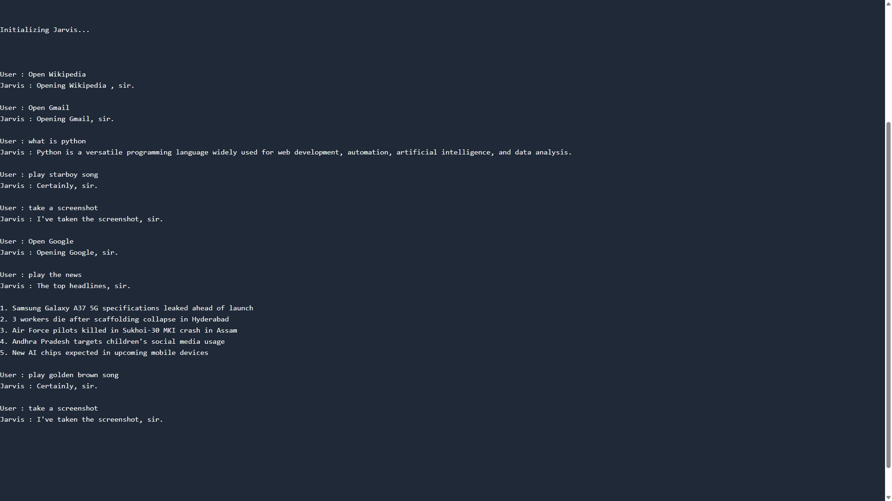

# Jarvis AI Voice Assistant


Jarvis is a Python-based voice assistant that executes commands, retrieves information, and interacts with AI services using voice input. It integrates speech recognition, text-to-speech synthesis, external APIs, and automation features to perform tasks such as opening websites, playing media, retrieving news, and generating AI-powered responses.

## Features

- Voice-activated command system using SpeechRecognition
- AI-generated responses powered by OpenAI API
- Media playback through YouTube Data API
- Real-time news retrieval via NewsData API
- Website automation through voice commands
- Screenshot capture automation
- Natural-sounding text-to-speech using Piper TTS
- Interactive conversational assistant workflow

## Technologies Used

**Programming Language**
- Python

**APIs**
- OpenAI API
- YouTube Data API v3
- NewsData API

**Libraries & Tools**
- SpeechRecognition
- Piper TTS
- PyAutoGUI
- Pygame
- Requests
- Pydub

## Project Structure

```
jarvis-ai-assistant/
│
├── main.py
├── config.py
├── requirements.txt
├── README.md
├── .gitignore
│
├── voices/
│   ├── alan-medium.onnx
│   └── alan-medium.onnx.json
```

## Requirements

- Python 3.9 or higher
- A working microphone for voice input
- Internet connection for API requests

## Installation

1. Clone the repository

```
git clone https://github.com/ttayubudeen/jarvis-ai-assistant.git
```

2. Navigate into the project folder

```
cd jarvis-ai-assistant
```

3. Install dependencies

```
pip install -r requirements.txt
```

4. Create a `.env` file and add your API keys

Example:

```
OPENAI_API_KEY=your_api_key_here
NEWS_API_KEY=your_news_api_key
GOOGLE_API_KEY=your_google_api_key
```

5. Run the project

```
python main.py
```

## Demo

Example interaction with the Jarvis assistant:



## Author

Mohammed Tayubudeen R